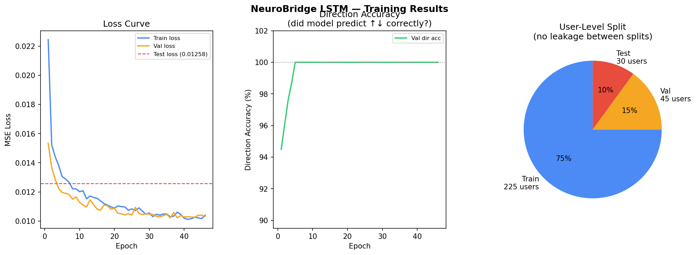

# NeuroBridge ML — Adaptive Dyslexia Parameter Engine

This is the machine learning pipeline that powers NeuroBridge's adaptive UI system.
It watches how a user reads, learns their patterns, and quietly adjusts the interface
to make reading easier — without the user ever having to configure anything manually.

---

## How It Works (Plain English)

```
User completes assessment
        ↓
Phase 1: Collaborative Filter
"You scored similarly to these 5 users.
 Start with the UI settings that worked for them."
        ↓
User reads, does tasks — every session logged silently
        ↓
Phase 2: LSTM (kicks in after enough sessions)
"I've been watching you for weeks.
 Your TTS usage is dropping. Your accuracy on phonological
 tasks is rising. Time to reduce scaffolding slightly."
        ↓
UI quietly evolves — font, spacing, difficulty, TTS — all adapt
        ↓
Rollback safety net: if 2 bad sessions in a row → revert last change
```

---

## Project Structure

```
neurobridge_ml/
├── run_all.py                          ← Run this to train everything
├── requirements.txt
└── ml/
    ├── data/
    │   ├── synthetic_generator.py      ← Generates 300 users × 25 sessions
    │   ├── users.json                  ← Generated user profiles + cognitive scores
    │   ├── sessions.json               ← Generated session behavioral data
    │   └── checkpoints/
    │       ├── collaborative_filter.npz  ← Phase 1 trained model
    │       ├── lstm_best.pt              ← Phase 2 trained model (best epoch)
    │       ├── loss_history.json         ← Train/val loss per epoch
    │       └── loss_curve.png            ← Training curve plot
    ├── models/
    │   ├── collaborative_filter.py     ← Phase 1 model class
    │   └── lstm_model.py               ← Phase 2 model class + apply_deltas()
    └── training/
        └── train_lstm.py               ← Full LSTM training script
```

---

## Inputs

### Assessment Scores (one-time, collected on Day 1)

These 6 scores come from the NeuroBridge cognitive assessment. Range: 0.0 (severe difficulty) → 1.0 (no difficulty).

| Score | What it measures |
|---|---|
| `phonological` | Sound-to-letter mapping, rhyming, phoneme blending |
| `visual` | Letter crowding, tracking, reversal sensitivity |
| `memory` | Working memory — holding words in mind while reading |
| `processing_speed` | How quickly the brain processes written symbols |
| `orthographic` | Recognition of word shapes and patterns |
| `executive` | Attention control, task-switching while reading |

These are the seed for Phase 1. Phase 2 never uses them directly — it watches behaviour instead.

The one edge case is when there are fewer than 5 users in the DB — then it skips the collaborative filter entirely and falls back to the hardcoded rule-based defaults based on severity (severe/moderate/mild/minimal). That's the cold-start safety net for when your platform is brand new.

### Session Behavioral Features (14 per session, collected silently every session)

| Feature | What it measures |
|---|---|
| `tts_rate` | TTS triggers / total words seen this session |
| `scroll_back_rate` | How often the user re-reads paragraphs |
| `avg_word_hover_ms` | Average time hovering on a word (normalised) |
| `acc_phonological` | Task accuracy — phonological tasks |
| `acc_visual` | Task accuracy — visual tasks |
| `acc_memory` | Task accuracy — memory tasks |
| `acc_processing` | Task accuracy — processing speed tasks |
| `acc_orthographic` | Task accuracy — orthographic tasks |
| `acc_executive` | Task accuracy — executive function tasks |
| `speed_vs_accuracy` | How fast vs how correct they are |
| `abandonment_rate` | Fraction of tasks abandoned (not completed) |
| `manual_setting_changes` | Did they manually override any accessibility setting |
| `focal_reading_usage` | Did they toggle focal reading mode |
| `session_length_norm` | Session length in minutes, normalised to [0, 1] |

---

## Outputs

The model outputs **deltas** — gentle nudges to 7 UI parameters. Never absolute values, always relative changes, always clamped to safe ranges.

| Parameter | Safe Range | Max Δ per session | Effect on UI |
|---|---|---|---|
| `font_size` | 16 – 48 px | ±2.0 px | Text size |
| `letter_spacing` | 0.0 – 0.20 em | ±0.010 em | Space between letters |
| `line_height` | 1.4 – 2.2 | ±0.08 | Vertical space between lines |
| `mask_opacity` | 0.0 – 1.0 | ±0.08 | Focal reading overlay intensity |
| `content_difficulty` | 1 – 10 | ±0.5 | Complexity of reading tasks |
| `read_aloud_dependency` | 0.0 – 1.0 | ±0.08 | How prominently TTS is offered |
| `font_family_stage` | 0 – 2 | ±0.3 | 0=OpenDyslexic, 1=Lexie, 2=system |

### How the output flows into your app

```
After each session:
  model.predict(last_8_sessions, current_params)
        ↓
  new_params = current_params + deltas   (clamped to safe ranges)
        ↓
  UPDATE adaptive_params SET ... WHERE user_id = ?
        ↓
  On next login: applyParamsFromServer()
        ↓
  document.documentElement.style.setProperty('--font-size', new_params.font_size + 'px')
  ... (same for all 7 params)
        ↓
  Entire app UI silently reflects the new values via CSS variables
```

---

## Training Results

The model was trained on 300 synthetic users × 25 sessions = 7,500 sessions total.
After feature windowing (window size = 8), this gives 5,100 training samples.



**What the curve shows:**
- Sharp drop in first 5 epochs — model quickly learned severity-to-params relationship
- Val loss tracks train loss closely — **no overfitting**
- Val loss slightly below train loss — expected (dropout is off during validation)
- Both converge at ~0.010 MSE — the model predicts deltas within ±0.1 of ground truth on average
- Early stopping triggered at epoch ~38 — training stopped automatically when learning plateaued

---

## Quickstart

### 1. Install dependencies
```bash
pip install torch numpy matplotlib scikit-learn
```

### 2. Train everything (one command)
```bash
python run_all.py
```

This runs all three steps in order and saves checkpoints automatically.

### 3. Run steps individually (optional)
```bash
# Step 1 — Generate synthetic data
python ml/data/synthetic_generator.py

# Step 2 — Train Phase 1 (Collaborative Filter)
python ml/models/collaborative_filter.py

# Step 3 — Train Phase 2 (LSTM)
python ml/training/train_lstm.py
```

---

## Using the Trained Models in Your Code

### Phase 1 — Get starting params for a new user

```python
import numpy as np
from ml.models.collaborative_filter import CollaborativeFilter

cf = CollaborativeFilter()
cf.load("ml/data/checkpoints/collaborative_filter.npz")

new_user_scores = {
    "phonological": 0.25,
    "visual": 0.60,
    "memory": 0.50,
    "processing_speed": 0.48,
    "orthographic": 0.32,
    "executive": 0.55,
}

initial_params = cf.predict(new_user_scores)
# → { font_size: 40.0, letter_spacing: 0.14, ... }
# Write these to adaptive_params table in your DB
```

### Phase 2 — Adapt params after a session

```python
import torch
from ml.models.lstm_model import AdaptiveParamLSTM

model = AdaptiveParamLSTM()
ckpt  = torch.load("ml/data/checkpoints/lstm_best.pt", map_location="cpu", weights_only=False)
model.load_state_dict(ckpt["model_state"])

# last_8_sessions: list of 8 session feature vectors (each 14 floats)
# current_params:  dict of the user's current adaptive params

new_params, deltas = model.predict_params(last_8_sessions, current_params)
# new_params → write to DB
# deltas     → log for rollback safety check
```

---

## Rollback Safety

If you detect 2 consecutive sessions where accuracy dropped after a param change:

```python
# Revert — just negate the last deltas
reverted = {k: current_params[k] - last_deltas[k] for k in current_params}
```

The max delta caps ensure a single session can never make a jarring change.

---

## When to Switch Phases

| Phase | Trigger | What's happening |
|---|---|---|
| Phase 1 only | Day 1 / new user | No session data yet — borrow from similar users |
| Phase 1 + Phase 2 blended | Sessions 8–20 | Enough data for LSTM, but blend with CF for stability |
| Phase 2 dominant | Session 20+ | LSTM has learned this specific user's patterns |

A simple way to blend: `final_delta = (1 - alpha) * cf_delta + alpha * lstm_delta` where alpha goes from 0 → 1 as sessions accumulate.

---

## Next Steps (when ready to integrate)

1. **Build the Event Logger** — `POST /api/events` endpoint + `session_events` DB table
2. **Build the Feature Engineering job** — nightly cron that converts raw events → 14-dim session vectors
3. **Build the Inference endpoint** — `POST /api/adapt` that loads the checkpoint and returns new params
4. **Wire CSS variables** — `applyParamsFromServer()` in `DyslexiaContext` on every login
5. **Switch from synthetic to real data** — once you have 50+ real users, retrain Phase 2 on real sessions

---

## Model Architecture (Phase 2 LSTM)

```
Input: (batch, T=8, 14)       — 8 sessions of 14 behavioral features
       ↓
LSTM (2 layers, hidden=64, dropout=0.2)
       ↓
Take last hidden state (batch, 64)
       ↓
Linear + ReLU + Dropout → (batch, 32)
       ↓
Concat with current_params (batch, 32+7=39)
       ↓
Linear + ReLU + Dropout → (batch, 32)
       ↓
Linear + Tanh → (batch, 7)    — raw delta in [-1, 1]
       ↓
Scale by MAX_DELTA_PER_SESSION → real-world deltas
       ↓
Output: (batch, 7)            — one gentle nudge per parameter
```

Total trainable parameters: ~22,000 (intentionally small — fast, deployable on CPU)
